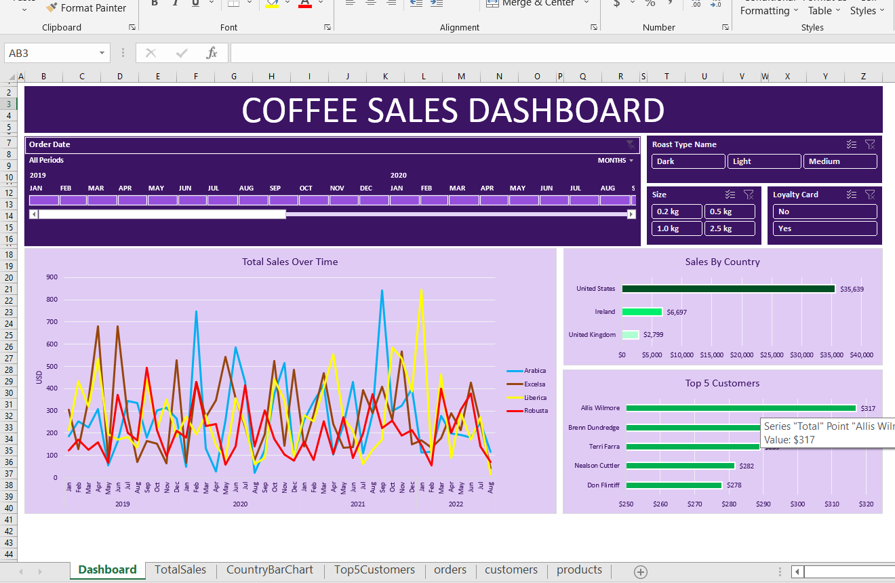

# ☕ Coffee Sales Interactive Excel Dashboard

An end-to-end interactive data analysis and visualization portfolio project built in Microsoft Excel. This dashboard tracks global coffee sales performance across different dimensions including time, country, product type, and customer segments.

---

## 📸 Dashboard Preview

---

## 📊 Key Features & Capabilities

* **Data Gathering & Transformation:** 
  * Merged multi-table relational data using advanced lookup formulas (`XLOOKUP` and dynamic two-way `INDEX & MATCH`).
  * Cleaned missing values using nested `IF` logic (e.g., removing zero values in empty email entries).
  * Formatted date structures, custom unit labels (`0.0 "kg"`), and currency formatting.
* **Dynamic Analysis & Aggregation:**
  * Created structured Pivot Tables for time-series analysis, revenue by country, and top customer rankings.
  * Applied `Top 5` value filters to highlight key revenue-generating customers.
* **Interactive Dashboard UI/UX:**
  * Built custom-styled **Interactive Timelines** for flexible date-range filtering (Years, Quarters, Months).
  * Implemented cross-connected **Slicers** (Roast Type, Size, Loyalty Card Status) via `Report Connections`.
  * Customized chart colors and layout for a cohesive purple-themed visual experience.

---

## 🛠️ Excel Formulas & Techniques Used

- `XLOOKUP`: For fetching customer names, emails, and loyalty status from lookup tables.
- `INDEX & MATCH`: For two-dimensional dynamic data extraction from product catalogs.
- `IF / ISBLANK`: For handling nulls and maintaining clean data.
- **Excel Tables (`Ctrl + T`)**: For dynamic data range expansion.
- **Pivot Tables & Pivot Charts**: For fast data aggregation and visual reporting.
- **Report Connections**: For linking slicers across multiple charts simultaneously.

---

## 💡 Key Business Insights

1. **Product Performance:** Arabica coffee yields the highest overall sales revenue across all regions.
2. **Geographic Distribution:** The United States represents the largest market share, followed by Ireland and the UK.
3. **Customer Retention:** A significant portion of revenue comes from customers with registered **Loyalty Cards**, demonstrating high retention potential.

---

## 📁 Repository Structure

├── Coffee_Sales_Dashboard.xlsx   # Main Excel file containing raw data, pivot tables, and dashboard ├── dashboard_preview.png          # Screenshot of the interactive dashboard └── README.md                      # Project documentation

---

## 🚀 How to View
1. Download or clone this repository.
2. Open `Coffee_Sales_Dashboard.xlsx` in **Microsoft Excel 2019 or later** (or Office 365) for full formula and timeline compatibility.
3. Interact with the timeline and slicers on the **Dashboard** tab to filter the metrics dynamically.
